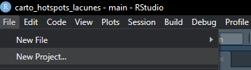
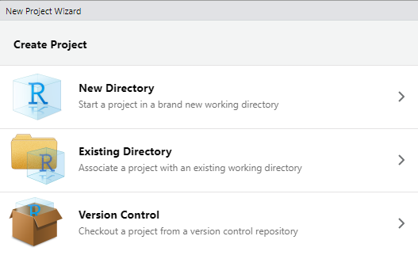
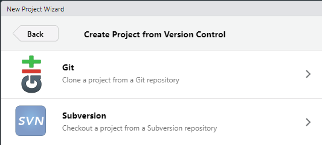
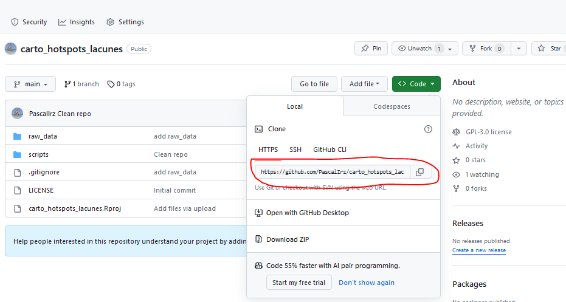
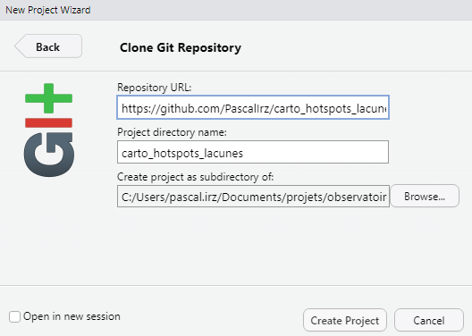
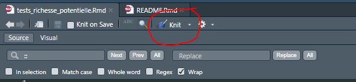
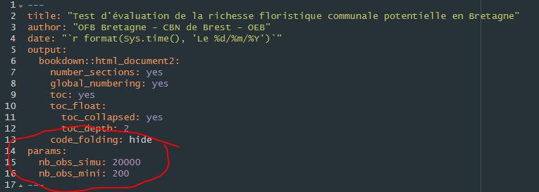
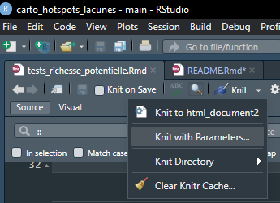
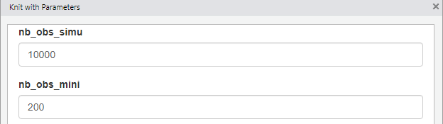

<!-- README.md is generated from README.Rmd. Please edit that file -->

```{r, include = FALSE}
knitr::opts_chunk$set(
  collapse = TRUE,
  comment = "#>"
)
```

# Objectifs du projet

<!-- badges: start -->
<!-- badges: end -->

Le projet vise à explorer si les données présentes dans la base du CBN Brest, couplées avec la "Carte des Grands Types de Végétation" (CGTV), permettent d'estimer la richesse potentielle en espèces de chaque commune. 

La principale difficulté réside dans la grande variabilité intercommunale d'effort de prospection.

Par richesse potentielle, on entend le nombre d'espèces qui seraient répertoriées présentes sur la commune si elle était très bien prospectée.

# Installation en local

## Configuration machine

Il faut disposer d'une machine où sont installés :

- [Git](https://git-scm.com/download/win)
- [R](https://cran.r-project.org/bin/windows/base/) et [RStudio](https://download1.rstudio.org/electron/windows/RStudio-2023.09.1-494.exe)

En outre, pour du travail collaboratif sur le projet, il faut disposer d'un compte [Github](https://github.com) et connecter RStudio à Github.

Une fois la machine configurée, installer les packages nécessaires qui sont sur le dépôt du [CRAN](https://cran.r-project.org/) :

```{r, eval = FALSE}
mes_packages <- c("MASS",
                  "tidyverse",
                  "remotes",
                  "PerformanceAnalytics",
                  "mapview",
                  "downloadthis",
                  "readxl",
                  "rmarkdown")

install.packages(setdiff(mes_packages, rownames(installed.packages())))
```

Installer ensuite, depuis son dépôt Github, du package `COGiter` qui contient le découpage communal pour les cartes.

```{r, eval = FALSE}
remotes::install_github("MaelTheuliere/COGiter")
```

## Clonage du dépôt depuis Github

Dans RStudio, utiliser le menu *File > New project*



Choisir *Version control*



Puis *Git*.



Avec le navigateur, copier l'url du dépôt à clôner en cliquant sur le bouton vert.



La coller pour spécifier l'URL. Laisser le nom du sous-répertoire par défaut. Choisir où ça doit être installé sur la machine et le spécifier sur la ligne du bas.



Cliquer sur *Create project*.

RStudio redémarre et le projet fonctionne.

>NB pour les utilisations ultérieures, pour lancer le projet, la bonne pratique est de double-cliquer sur le fichier `carto_hotspots_lacunes.Rproj` situé à la racine.  

# Utilisation

## Répertoires et fichiers

Les données sont dans le sous-répertoire `raw_data` et le code dans `script`.

C'est le fichier `tests_richesse_potentielle.Rmd` qui premet de produire la sortie `.html`. Il est en forma [R markdown](https://lms.fun-mooc.fr/c4x/UPSUD/42001S02/asset/RMarkdown.html), conçu pour permettre d'imbriquer du texte, des contenus existants (images, etc.), des éléments de code et leur résultat.

## Exécution par défaut

Pour exécuter le fichier, simplement cliquer sur l'icone "Knit" :



C'est suffisant pour l'exécuter "par défaut". Une fenêtre de visualisation s'ouvre et un fichier `.html` avec le même nom que le document R Markwown est créé dans le même sous-répertoire.

## Exécution paramétrée

Afin de permettre à l'utilisateur de tester d'autres hypothèses que celles retenues par défaut, le fichier `.Rmd` accepte deux paramètres qui sont spécifiés dans l'en-tête :



Ces paramètres concernent :

- `nb_obs_simu` : Nombre d'observations utilisé pour simuler le potentiel de richesse si chaque commune avait été très bien prospectée. Dans l'exemple ci-dessus, par défaut il est fixé à 20000. La richesse potentielle d'une commune est donc la richesse qui serait observée si la commune avait connu un effort de prospection de 20000 observations.  
- `nb_obs_mini` : Nombre minimum d'observations pour qu'une commune soit incluse dans le jeu de données de calage du modèle. En effet, les communes les moins prospectées ne renseignent pas réellement sur la richesse potentielle. Par défaut, `nb_obs_mini` est fixé à 200 observations.

Pour obtenir les résultats en faisant varier les paramètres, cliquer sur la petite flêche à droite du bouton "Knit" pour dérouler le menu. Choisir *Knit with parameters*.



Renseigner les nouvelles valeurs des paramètres.



Valider et ... admirer le résultat.
