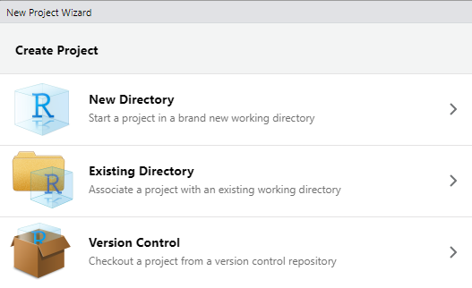
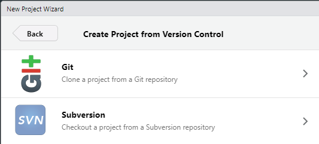
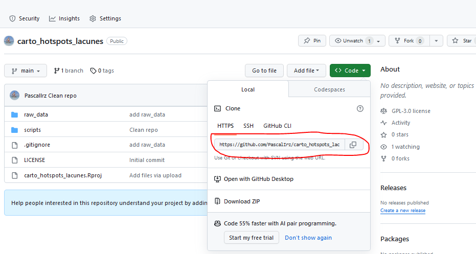
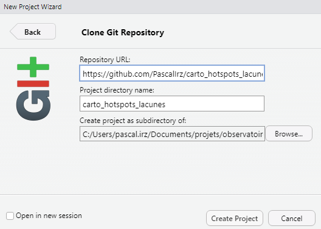
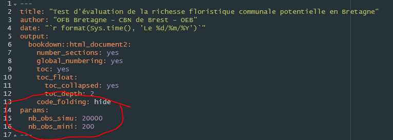
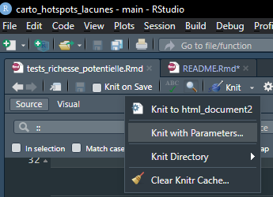

Test d’évaluation de la richesse floristique communale potentielle en
Bretagne
================
OFB Bretagne - CBN de Brest - OEB

<!-- README.md is generated from README.Rmd. Please edit that file -->

# Objectifs du projet

<!-- badges: start -->
<!-- badges: end -->

Le projet vise à explorer si les données présentes dans la base du CBN
Brest, couplées avec la “Carte des Grands Types de Végétation” (CGTV),
permettent d’estimer la richesse potentielle en espèces de chaque
commune.

La principale difficulté réside dans la grande variabilité
intercommunale d’effort de prospection.

Par richesse potentielle, on entend le nombre d’espèces qui seraient
répertoriées présentes sur la commune si elle était très bien
prospectée.

# Installation en local

## Configuration machine

Il faut disposer d’une machine où sont installés :

- [Git](https://git-scm.com/download/win)
- [R](https://cran.r-project.org/bin/windows/base/) et
  [RStudio](https://download1.rstudio.org/electron/windows/RStudio-2023.09.1-494.exe)

En outre, pour du travail collaboratif sur le projet, il faut disposer
d’un compte [Github](https://github.com) et connecter RStudio à Github.

Une fois la machine configurée, installer les packages nécessaires qui
sont sur le dépôt du [CRAN](https://cran.r-project.org/) :

``` r
mes_packages <- c("MASS",
                  "tidyverse",
                  "remotes",
                  "PerformanceAnalytics",
                  "mapview",
                  "downloadthis",
                  "readxl",
                  "rmarkdown")

install.packages(setdiff(mes_packages, rownames(installed.packages())))
```

Installer ensuite, depuis son dépôt Github, du package `COGiter` qui
contient le découpage communal pour les cartes.

``` r
remotes::install_github("MaelTheuliere/COGiter")
```

## Clonage du dépôt depuis Github

Dans RStudio, utiliser le menu *File \> New project*


Choisir *Version control*



Puis *Git*.



Avec le navigateur, copier l’url du dépôt à clôner en cliquant sur le
bouton vert.



La coller pour spécifier l’URL. Laisser le nom du sous-répertoire par
défaut. Choisir où ça doit être installé sur la machine et le spécifier
sur la ligne du bas.



Cliquer sur *Create project*.

RStudio redémarre et le projet fonctionne.

> NB pour les utilisations ultérieures, pour lancer le projet, la bonne
> pratique est de double-cliquer sur le fichier
> `carto_hotspots_lacunes.Rproj` situé à la racine.

# Utilisation

## Répertoires et fichiers

Les données sont dans le sous-répertoire `raw_data` et le code dans
`script`.

C’est le fichier `tests_richesse_potentielle.Rmd` qui premet de produire
la sortie `.html`. Il est en forma [R
markdown](https://lms.fun-mooc.fr/c4x/UPSUD/42001S02/asset/RMarkdown.html),
conçu pour permettre d’imbriquer du texte, des contenus existants
(images, etc.), des éléments de code et leur résultat.

## Exécution par défaut

Pour exécuter le fichier, simplement cliquer sur l’icone “Knit” :


C’est suffisant pour l’exécuter “par défaut”. Une fenêtre de
visualisation s’ouvre et un fichier `.html` avec le même nom que le
document R Markwown est créé dans le même sous-répertoire.

## Exécution paramétrée

Afin de permettre à l’utilisateur de tester d’autres hypothèses que
celles retenues par défaut, le fichier `.Rmd` accepte deux paramètres
qui sont spécifiés dans l’en-tête :



Ces paramètres concernent :

- `nb_obs_simu` : Nombre d’observations utilisé pour simuler le
  potentiel de richesse si chaque commune avait été très bien
  prospectée. Dans l’exemple ci-dessus, par défaut il est fixé à 20000.
  La richesse potentielle d’une commune est donc la richesse qui serait
  observée si la commune avait connu un effort de prospection de 20000
  observations.  
- `nb_obs_mini` : Nombre minimum d’observations pour qu’une commune soit
  incluse dans le jeu de données de calage du modèle. En effet, les
  communes les moins prospectées ne renseignent pas réellement sur la
  richesse potentielle. Par défaut, `nb_obs_mini` est fixé à 200
  observations.

Pour obtenir les résultats en faisant varier les paramètres, cliquer sur
la petite flêche à droite du bouton “Knit” pour dérouler le menu.
Choisir *Knit with parameters*.



Renseigner les nouvelles valeurs des paramètres.


Valider et … admirer le résultat.
